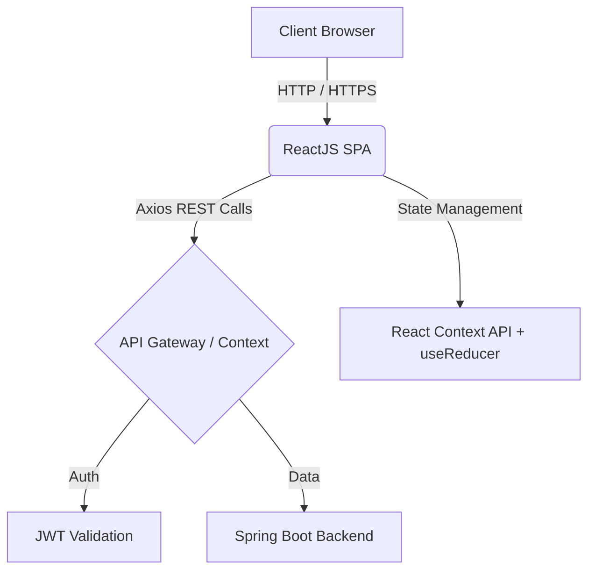

<div align="center">
  
  
  <h1 style="color: #e8832a; font-family: 'Playfair Display', serif;">LUXURY BUS MANAGEMENT SYSTEM</h1>
  <p><b>PHÂN HỆ GIAO DIỆN NGƯỜI DÙNG (FRONTEND)</b></p>
  
  <p>
    <i>Hệ thống quản lý bến xe khách cao cấp, mang trải nghiệm đặt vé chuẩn Enterprise với thiết kế "White Luxury".</i>
  </p>

  <p>
    <a href="#technologies"></a>
    <a href="#technologies"></a>
    <a href="#technologies"></a>
    <a href="#technologies"></a>
  </p>
</div>

<hr />

## 📖 GIỚI THIỆU TỔNG QUAN

Chào mừng đến với hệ thống **Luxury Bus Management**. Đây không chỉ là một ứng dụng đặt vé xe thông thường, mà là một nền tảng thương mại điện tử giao thông vận tải cao cấp. Được thiết kế theo ngôn ngữ **White Luxury** (Trắng tinh tế kết hợp điểm nhấn Vàng/Cam sang trọng), hệ thống mang lại trải nghiệm mượt mà, chuyên nghiệp và đẳng cấp cho cả Khách hàng lẫn Ban quản trị.

---

## ✨ TÍNH NĂNG ĐỘC QUYỀN (PREMIUM FEATURES)

### 💎 Trải nghiệm Hành khách (Passenger Portal)
- 🎫 **Đặt vé & Chọn ghế trực quan (Visual Seat Mapping):** Giao diện chọn giường nằm 2 tầng trực quan, cập nhật trạng thái ghế realtime.
- 🎟️ **Hệ thống Mã Giảm Giá (Smart Voucher):** Tự động tính toán chiết khấu, trừ thẳng vào giá tiền khi nhập mã (VD: `SALE20`).
- 📱 **Vé Điện Tử QR Code & PDF:** 
  - Khởi tạo mã QR động ngay khi thanh toán thành công.
  - Tích hợp tính năng **Tải vé định dạng PDF** chuẩn ngành.
- 💳 **Thanh toán Đa kênh (Omnichannel Payment):** Hỗ trợ VNPay, PayPal, MoMo, ZaloPay, ShopeePay,...
- 🤖 **Trợ lý Ảo AI (AI Booking Assistant):** Tích hợp Chatbot nổi (Floating widget) tự động phân tích ý định và tư vấn chuyến đi 24/7.
- 📍 **Theo dõi vị trí xe Live (Live GPS Tracking):** Bản đồ tương tác trực tiếp, báo cáo vị trí xe khách đang chạy trên đường.

### 📈 Quản trị Doanh nghiệp (Enterprise Dashboard)
- 📊 **Phân tích dữ liệu (Data Analytics):** Trang thống kê sử dụng `Recharts` vẽ biểu đồ doanh thu tháng, cơ cấu người dùng và lượt chuyến.
- 📥 **Trích xuất Dữ liệu (Export CSV):** Hỗ trợ Admin tải xuống báo cáo dạng Excel để phục vụ kế toán.
- 🚌 **Quản lý Nguồn lực toàn diện (Resource Management):** Quản lý Tuyến đường, Trạm trung chuyển, Xe khách, Lịch trình, Nhân viên và Hành khách.

---

## 🏗️ KIẾN TRÚC HỆ THỐNG (ARCHITECTURE)



### Cấu trúc thư mục cốt lõi
```text
src/
├── components/       # Các UI Component độc lập (Button, Modal, Card...)
│   ├── booking/      # Xử lý luồng đặt vé, mã giảm giá, QR Code
│   ├── chat/         # Chứa module Trợ lý ảo AI & Firebase Chat
│   ├── manager/      # Giao diện cho Admin (Dashboard, Export CSV)
│   └── payment/      # Cổng giao tiếp VNPay, PayPal
├── configs/          # Cấu hình API, Base URL (Apis.js)
├── contexts/         # Quản lý Global State (Auth, Cart)
├── services/         # Helper functions gọi API, xử lý Logic Maps
├── utils/            # Các tiện ích format ngày, tiền tệ, validate
└── index.css         # Token thiết kế hệ thống (Màu White Luxury)
```

---

## 🚀 HƯỚNG DẪN TRIỂN KHAI (DEPLOYMENT)

### 1. Chuẩn bị môi trường
Hãy đảm bảo máy tính của bạn đã cài đặt:
- Node.js (phiên bản `v16.0.0` trở lên)
- NPM hoặc Yarn

### 2. Cài đặt cục bộ (Local Setup)
```bash
# 1. Clone mã nguồn
git clone https://github.com/Tranloc12/Frontend-Web.git

# 2. Di chuyển vào dự án
cd Frontend-Web/carmanagementweb

# 3. Cài đặt các thư viện cần thiết
npm install

# 4. (Tùy chọn) Khởi tạo các thư viện mở rộng nếu thiếu
npm install html2pdf.js recharts react-qr-code

# 5. Chạy dự án
npm start
```
> Trình duyệt sẽ tự động mở trang web tại địa chỉ: `http://localhost:3000`

### 3. Cấu hình Endpoint
Mặc định hệ thống trỏ về Cloud Backend. Nếu bạn muốn test với Backend đang chạy trên máy cá nhân, hãy mở file `src/configs/Apis.js` và chỉnh sửa:
```javascript
// Bỏ comment dòng này để chạy local
// const BASE_URL = "http://localhost:8080/CarManagementApp/api"; 
const BASE_URL = process.env.REACT_APP_API_URL || "https://doannganhquanlixekhach.onrender.com/api";
```

---

## 🎨 THIẾT KẾ UI/UX (DESIGN SYSTEM)
Dự án tuân thủ nghiêm ngặt bảng màu **White Luxury**:
- ⚪ **Background:** `#ffffff` (Trắng tinh khiết) & `#faf9f7` (Xám nhạt ấm)
- 🟠 **Primary Accents:** `#e8832a` (Cam hoàng kim) & `#f09a40` (Vàng hoàng kim)
- ⚫ **Text:** `#1a1410` (Đen trầm) & `#5c4f3a` (Nâu xám)
- **Typography:** `Playfair Display` (Tiêu đề sang trọng) & `Inter` (Nội dung dễ đọc).

---
<div align="center">
  <p><i>Made with ❤️ by Nhóm Phát Triển - Đồ Án Chuyên Ngành CNTT</i></p>
</div>
