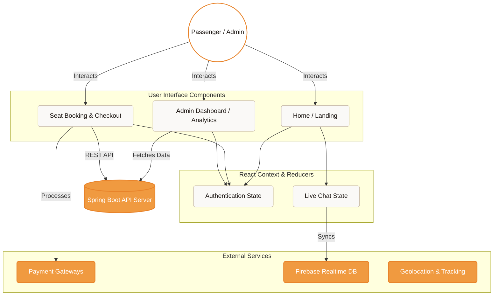

<div align="center">
  
  
  <h1 align="center" style="font-weight: 300; letter-spacing: 2px;">TRANSPORTATION MANAGEMENT SYSTEM</h1>
  <p align="center" style="font-size: 1.1em; color: #666; font-style: italic;">
    — FRONTEND APPLICATION PORTAL —
  </p>

  <p align="center" style="margin-top: 20px;">
    
    
    
    
  </p>
</div>

<br/>

## 1. PROJECT OVERVIEW
This repository contains the front-end application for the Transportation Management System. Designed with an emphasis on minimalism, clarity, and enterprise-grade performance, the interface ensures a seamless booking experience for passengers and a robust management dashboard for administrators.

## 2. SYSTEM ARCHITECTURE

The application follows a modern Single Page Application (SPA) architecture, utilizing React Context for state management and Axios for RESTful communication.



## 3. CORE MODULES

### Passenger Interface
*   **Interactive Seat Selection**: Real-time synchronization of seat availability mapped to physical bus layouts.
*   **Dynamic Pricing & Promotions**: Automated voucher validation and checkout recalculation.
*   **Digital Boarding Pass**: Instant PDF ticket generation and dynamic QR code generation for scanning at terminals.
*   **Omnichannel Payments**: Seamless integration with VNPay, PayPal, and digital wallets.
*   **AI Assistant & Live Chat**: Embedded floating widgets providing 24/7 automated support and human-agent routing.

### Administrator Dashboard
*   **Data Visualization**: Integrated Recharts providing interactive Line, Bar, and Pie charts for revenue and demographic analysis.
*   **Data Exportation**: One-click CSV/Excel report generation for accounting and auditing.
*   **Resource Management**: Full CRUD capabilities for route planning, fleet management, and staff assignments.

## 4. DIRECTORY STRUCTURE

```text
src/
├── components/           # Reusable UI modules
│   ├── booking/          # Checkout logic, Seat matrix, PDF generation
│   ├── chat/             # AI Assistant logic & Firebase integration
│   ├── manager/          # Administrative tables, charts, export modules
│   └── payment/          # Gateway integrations (VNPay, PayPal)
├── configs/              # Environment variables, API interceptors
├── contexts/             # Global state (UserContext, ChatContext)
├── services/             # Background tasks (Notifications, Geolocation)
├── utils/                # Pure functions (Date formatting, Currency formatting)
└── App.js                # Root router & Layout wrapper
```

## 5. DEPLOYMENT GUIDE

### Prerequisites
*   Node.js v16.x or higher
*   NPM package manager

### Local Environment Setup
```bash
# Clone the repository
git clone https://github.com/Tranloc12/Frontend-Web.git

# Navigate to the workspace
cd Frontend-Web/carmanagementweb

# Install required dependencies
npm install

# Start the development server
npm start
```
The application will launch on `http://localhost:3000`.

### API Configuration
To direct API calls to your local backend environment, modify `src/configs/Apis.js`:
```javascript
const BASE_URL = process.env.REACT_APP_API_URL || "http://localhost:8080/CarManagementApp/api";
```

<br/>
<div align="center">
  <hr style="width: 50%; border: 1px solid #eaeaea;" />
  <p style="color: #888; font-size: 0.9em; margin-top: 20px;">
    <i>Architected for Scalability, Designed for Excellence.</i>
  </p>
</div>
