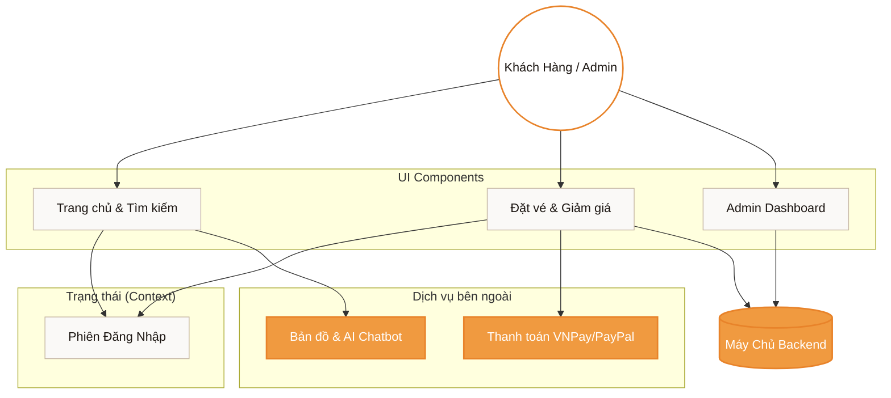

<div align="center">
  
  
  <h1 align="center" style="font-weight: 300; letter-spacing: 2px;">HỆ THỐNG QUẢN LÝ XE KHÁCH CAO CẤP</h1>
  <p align="center" style="font-size: 1.1em; color: #666; font-style: italic;">
    — PHÂN HỆ GIAO DIỆN NGƯỜI DÙNG (FRONTEND) —
  </p>

  <p align="center" style="margin-top: 20px;">
    
    
    
    
  </p>
</div>

<br/>

## 1. TỔNG QUAN DỰ ÁN
Đây là kho lưu trữ mã nguồn Frontend cho Đồ án **Hệ Thống Quản Lý Bến Xe Khách**. Giao diện được thiết kế theo ngôn ngữ **White Luxury**, tối giản nhưng vô cùng sang trọng, mang lại trải nghiệm đặt vé và quản trị chuyên nghiệp chuẩn doanh nghiệp (Enterprise).

---

## 2. CHI TIẾT CÁC TÍNH NĂNG VÀ CHỨC NĂNG (MODULES & FEATURES)

Dự án phân chia các nhóm chức năng rõ ràng, phục vụ đầy đủ cho mọi đối tượng tham gia vào hệ thống vận tải.

### 🙎‍♂️ Dành cho Hành Khách (Passenger)
- **Tư vấn AI & CSKH:** Tích hợp Trợ lý ảo AI (Chatbot nổi) hỗ trợ giải đáp tự động và hệ thống Live Chat (Firebase) kết nối với nhân viên.
- **Tìm kiếm & Đặt vé:** Tìm kiếm chuyến đi theo điểm đi/đến, ngày giờ. Chọn ghế trên **Sơ đồ xe trực quan 2 tầng**.
- **Áp dụng Mã giảm giá (Voucher):** Ô nhập Promo Code tự động tính toán và giảm trừ trực tiếp vào tổng hóa đơn thanh toán.
- **Thanh toán trực tuyến đa kênh:** Hỗ trợ thanh toán bảo mật qua **VNPay** và **PayPal**.
- **Quản lý Vé Điện tử (E-Ticket):** 
  - Xem danh sách vé đã đặt.
  - Hiển thị **Mã QR Code** quét vé thực tế.
  - Tích hợp xuất và **Tải vé định dạng PDF**.
- **Định vị & Theo dõi xe:** Tích hợp Google Maps / Leaflet hiển thị Real-time vị trí xe đang chạy.

### 👔 Dành cho Quản Trị Viên (Admin & Manager)
- **Dashboard Thống kê (Analytics):** Bảng điều khiển tích hợp Recharts vẽ biểu đồ Doanh thu (Line), Tuyến xe (Bar) và Cơ cấu khách hàng (Pie).
- **Xuất Báo Cáo:** Chức năng tải xuống dữ liệu thống kê dưới dạng file Excel/CSV phục vụ công tác kế toán.
- **Quản lý Hệ thống Toàn diện (CRUD):**
  - *Quản lý Tài khoản & Phân quyền:* Thêm, sửa, xóa, khóa tài khoản Nhân viên, Tài xế, Khách hàng.
  - *Quản lý Tuyến đường:* Khởi tạo điểm đi, điểm đến, lộ trình.
  - *Quản lý Chuyến xe & Lịch trình:* Setup chuyến chạy, gán tài xế, gán xe, định giá vé.
  - *Quản lý Phương tiện (Bus):* Quản lý biển số, số ghế, loại xe.
  - *Quản lý Bến bãi & Điểm trung chuyển.*
- **Quản lý Đánh giá (Reviews):** Theo dõi, kiểm duyệt và xóa các đánh giá tiêu cực từ khách hàng.

### 🚌 Dành cho Tài Xế (Driver)
- **Xem Lịch Trình (Schedule):** Bảng phân công chuyến đi chi tiết (ngày giờ, tuyến, xe).
- **Cập nhật trạng thái:** Gửi tín hiệu tọa độ (GPS) để hệ thống Tracking cập nhật vị trí lên bản đồ cho hành khách.

---

## 3. SƠ ĐỒ KIẾN TRÚC GIAO DIỆN



---

## 4. HƯỚNG DẪN CÀI ĐẶT

```bash
# 1. Tải mã nguồn về máy
git clone https://github.com/Tranloc12/Frontend-Web.git

# 2. Truy cập thư mục
cd Frontend-Web/carmanagementweb

# 3. Cài đặt các thư viện phụ thuộc
npm install

# 4. Khởi chạy ứng dụng
npm start
```
Truy cập `http://localhost:3000` trên trình duyệt để sử dụng.

<br/>
<div align="center">
  <hr style="width: 50%; border: 1px solid #eaeaea;" />
  <p style="color: #888; font-size: 0.9em; margin-top: 20px;">
    <i>Thiết kế hướng tới trải nghiệm người dùng tối cao.</i>
  </p>
</div>
